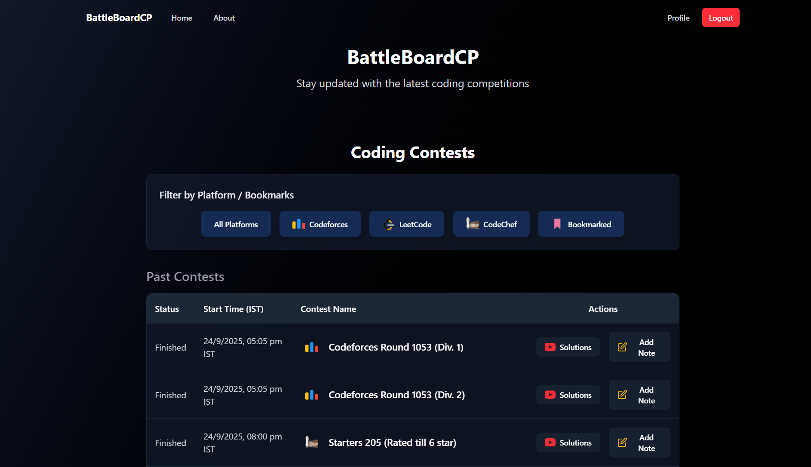

# 🏆 BattleBoardCP: Code Contest Tracker

<div align="center">
  
  **⚔️ Your ultimate dashboard for coding contests — track, compete, and improve like a pro!**
  
  
  
  [](https://codecontesttracker.onrender.com)

  
</div>

## 📋 Table of Contents

- [Why BattleBoardCP?](#-why-i-built-battleboardcp)
- [Screenshots](#-screenshots)
- [Key Features](#-key-features)
- [Tech Stack](#-tech-stack)
- [Installation & Setup](#-installation--setup)
- [Contributing](#-contributing)
- [Feel free to connect with me!](#feel-free-to-connect-with-me)

## 🚀 Why I Built BattleBoardCP

### The Problem 🤔
Seeing my peers struggle to keep up with coding contests, I noticed problems such as:

- Missing contests because there was no easy way to track them  
- Jumping between multiple platforms like Codeforces, CodeChef, and LeetCode  
- Losing track of past contests and their performance trends  
- Scattered notes, bookmarks, and solutions  
- No single dashboard to manage everything efficiently  

### My Solution 💡
I created **BattleBoardCP** to fix these issues. It’s a **unified platform** that helps you:

- 🎯 **Centralize contests** from all major platforms in one place  
- ⏰ **Never miss a contest** with customizable email reminders  
- 📊 **Track your progress** with detailed analytics and history  
- 📝 **Organize** your notes, bookmarks, and solutions efficiently  
- ⚡ **Save time** by eliminating the need to check multiple websites  


## 📸 Screenshots

<div align="center">
  
  <br />
  
  <br />
  
  <br />
  
</div>

## ✨ Key Features

- Real-time contest updates from Codeforces, CodeChef, and LeetCode  
- Personalized contest bookmarking & notes  
- Email reminders for upcoming contests  
- Performance analytics and progress tracking  
- Secure OTP-based authentication  

## 🛠️ Tech Stack

I kept it simple with **MERN stack + a few extras**:

- **Frontend** → React, Vite, Tailwind CSS  
- **State Management** → Redux  
- **Backend** → Node.js, Express  
- **Database** → MongoDB  
- **APIs** → CLIST API (contests), YouTube API (tutorials)  
- **Other Tools** → Nodemailer (emails), node-cron (reminders)

<div align="left">
  
[](#)
[](#)
[](#)
[](#)
[](#)
[](#)
[](#)

</div>

## ⚙️ Installation & Setup

### Prerequisites

Before you begin, ensure you have the following installed:
- Node.js (v18.x or higher)
- npm or yarn
- MongoDB (local or Atlas account)
- Git

### Step-by-Step Setup Guide

1. **Clone the Repo**
   ```bash
   git clone https://github.com/nikpatil7/BattleBoardCP.git

   cd BattleBoardCP
   ```

2. **Frontend Setup**
   ```bash
   cd frontend

   npm install

   echo "VITE_REACT_APP_BASE_URL=http://localhost:3030" > .env

   npm run dev
   ```

3. **Backend Setup**
   ```bash
   cd backend

   npm install

   # Create .env file with your credentials
   # Replace the values with your actual credentials
   cat > .env << EOL
   MONGODB_URI=your_mongodb_uri
   JWT_SECRET=your_jwt_secret
   EMAIL_USER=your_email
   EMAIL_PASS=your_email_password
   PORT=3030
   EOL

   npm run dev
   ```

### Environment Variables

#### Frontend (.env)
- `VITE_REACT_APP_BASE_URL`: Backend API URL (default: http://localhost:3030)

#### Backend (.env)
- `MONGODB_URI`: MongoDB connection string
- `JWT_SECRET`: Secret key for JWT token generation
- `EMAIL_USER`: Email for sending notifications
- `EMAIL_PASS`: Email app password
- `PORT`: Server port (default: 3030)

## 🤝 Contributing

Contributions are welcome! Please follow these steps:

1. **Fork** the repository
2. **Create** a feature branch (`git checkout -b feature/new-feature`)
3. **Commit** your changes (`git commit -m 'Add new feature'`)
4. **Push** to the branch (`git push origin feature/new-feature`)
5. **Open** a Pull Request

For major changes, please open an issue first to discuss what you would like to change.

<!-- ## Link to the website:

Click on the Gif, you will be redirected to the website
[](https://codecontesttracker.onrender.com)

Still Here? [Click Here](https://codecontesttracker.onrender.com) -->

## Feel free to connect with me!

<div align="center">
  <a href="mailto:nikhilpatil4714@gmail.com">
    
  </a>
  <a href="https://www.linkedin.com/in/nikhilpatil47/">
    
  </a>
  <a href="https://github.com/nikpatil7/BattleBoardCP/issues">
    
  </a>
</div>


---

<div align="center">
  
  <br />
  If you found this project helpful, please consider giving it a ⭐!
</div>